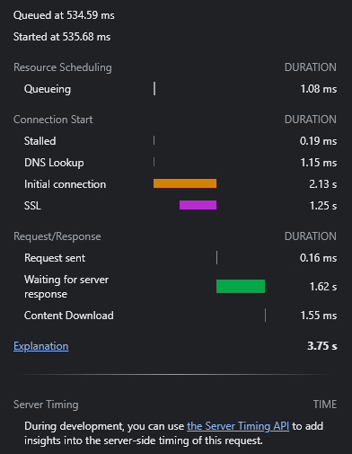

# AJAX | Récupération de données (GET)

✅ https://sximenez.github.io/AJAX/

## Comment fonctionne un navigateur ?

Avant de comprendre ce qu'est AJAX, comprenons comment fonctionne un navigateur web.

Commençons par définir le terme __navigation__.

Naviguer, c'est toute action qu'on effectue sur un navigateur ou sur une page web : 

- solliciter un site en tapant l'url dans la barre d'en haut,
- cliquer sur un lien,
- envoyer un formulaire, 
- etc.

Lorsqu'on fait ces actions, on s'attend à une réponse de la part du navigateur.
Pour nous répondre, le navigateur doit aller chercher cette réponse quelque part. 

Puisque la réponse, nous ne l'avons pas en local (sur notre pc), le navigateur doit solliciter un serveur (qui héberge la réponse à distance).

Prenons l'exemple du site dont on tape l'url.

On appuie sur 'entrer' et le navigateur commence par ce qu'on appelle une recherche ```DNS```.

### Recherche DNS (DNS lookup)

La première étape, c'est de savoir où se situe la réponse, quelle est l'adresse du serveur.

Le navigateur effectue donc une requête à un serveur spécial qui lui fournit cette adresse (ou pas).

Dans le premier cas, le serveur fournit une ```adresse IP```.

Si c'est la première fois qu'on demande au navigateur d'aller sur ce site, c'est ce processus DNS qui a lieu.

Si c'est la enième fois, notre navigateur garde en mémoire l'adresse pour s'y référer ultérieurement (notion de ```cache```).

Et si on cherche sur Google ? Google nous propose une liste d'url en réponse à notre recherche, et notre navigateur entame la recherche DNS si le site lui est inconnu.

Ok, et maintenant ?

### TCP Handshake

Le navigateur connaît désormais l'adresse du serveur qui héberge la réponse.

Pour établir une connexion, le navigateur sollicite le serveur à l'aide d'un ```protocole```, une convention pour communiquer.

C'est le TCP ou __Transmission Control Protocol__.

Il garantit que les infos qu'ils s'échangent arrivent correctement.

En gros, le navigateur dit "SYN __(synchronize)__", le serveur répond "SYN-ACK", puis le navigateur finit par "ACK __(acknowledge)__".

Et là, c'est bon, connexion établie en HTTP.

### TLS Negotiation

Pour avoir une connexion sécurisée (HTTPS), il y a une étape supplémentaire.

Le navigateur demande au serveur d'envoyer un certificat confirmant son identité.

Le TLS est crucial car il encrypte la communication et réduit les chances de vol d'informations.

Une fois tout ça terminé, le navigateur peut enfin demander la réponse !

### Réponse

Ok, maintenant le navigateur effectue une ```requête HTTP``` auprès du serveur, une action souhaitée.

Le serveur répond le plus souvent avec une ressource HTML.

Il y a plusieurs types de requêtes HTTP :

- ```GET``` : récupérer des données de la ressource
- ```HEAD``` : pareil que GET mais uniquement l'en-tête de la ressource
- ```POST``` : envoyer des données qui altèrent l'état de la ressource côté serveur
- ```PUT``` : remplacer des éléments de la ressource
- ```DELETE``` : effacer un élément de la ressource
- ```CONNECT```
- ```OPTIONS```
- ```TRACE```
- ```PATCH```

Dans notre cas, le navigateur fait une requête HTTP ```GET```.

Le temps que prend au navigateur de passer par toutes ces étapes (DNS, TCP, TLS, HTTP GET) et de recevoir le premier octet d'information s'appelle le ```Time to first byte``` (TTFB).

Il se mesure en millisecondes !

```TTFB = responseStart - navigationStart```

### Règle des premiers 14KB

Le premier paquet d'informations HTML que le navigateur reçoit du serveur pèse en général 14KB (14 * 1000 octets = 14000 octets ou l'équivalent de 7000 caractères Unicode 16 bits).

Le second 28KB, puis plus grand jusqu'à ce que la capacité maximale d'échange que supporte le réseau soit atteinte ou qu'il y ait de la congestion.

Cela fait partie d'un algorithme de contrôle appelé ```TCP Slow Start``` qui vise à démarrer petit pour ne pas saturer le réseau tout de suite.

> Il convient donc d'être conscient de cette règle et d'inclure dans ces 14KB l'essentiel de la page, sa structure de base.

Le serveur envoie donc l'information demandée par le navigateur en morceaux TCP, et le navigateur répond par des 'ACK'. Si la vitesse d'envoi est trop importante, le navigateur ne répond pas, ce qui permet au serveur de ralentir et de trouver un équilibre.

### Parsing

A partir du moment où le premier paquet est reçu (14KB), le navigateur ne perd pas de temps et interprète ou 'parse' les informations, leur syntaxe.

C'est là qu'interviennent les notions de ```DOM``` (Document Object Model) et de ```CCSOM``` (CSS Object Model).

En gros, ce sont des ```API```, on y reviendra plus tard, qui permettent au navigateur de représenter du HTML et du CSS, et d'en modifier l'affichage à l'écran à l'aide de Javascript (notion d'```objet```).

Il y a cinq étapes dans ce processus de parsing :

#### 1. Construire l'arbre du DOM

Avec son 'parseur', le navigateur lit la structure des balises HTML (__tokenization__) et construit un 'arbre'. Logiquement, si la structure HTML en entrée est claire, le parsing se fait rapidement.

L'arbre commence par l'élément ```<html>```, puis ```<head>``` et ```<body>```. Viennent ensuite le reste des éléments.

Certaines ressources comme les images ne ralentissent pas le parseur, il les demande et continue.

Cependant, des tags ```<script>``` peuvent ralentir son travail, notamment s'ils sont lourds.

Construire l'arbre du DOM est la tâche principale du navigateur à ce stade. En parallèle, un autre programme, le ```preload scanner```, s'occupe de demander des ressources importantes comme le CSS, le Javascript ou les polices. 

Comme cela, quand le parseur rencontre la balise, il a déjà ce dont il a besoin pour compléter l'arbre.

> Pour éviter qu'un script Javascript ralentisse le processus, rajoute l'attribut ```async``` ou ```defer``` si l'ordre de parsing est important

#### 2. Construire l'arbre du CCSOM, JS et AOM

Une fois que l'arbre du DOM est fait, le navigateur s'attaque à l'arbre du CSS. Il interprète la ressource CSS obtenue du serveur et crée une carte avec sa hiérarchie parent, enfant, frère, puis affine le tout.

Ce processus est très, très rapide.

En parallèle, le navigateur interprète les fichiers Javascript et crée également des arbres (__compilation Javascript__).

Le navigateur crée un arbre d'```accessibilité``` pour permettre aux appareils d'interagir avec le contenu, le ```AOM``` (accessibility object model).

#### 3. Rendering

Les arbres décrit précédemment sont ensuite combinés en un seul arbre qui permet de générer la mise en page de chaque élément et leur affichage.

Cet ```arbre de style``` généré ne contient que les éléments qui vont apparaître à l'écran : les éléments comme ```<head>``` y sont exclus, mais les noeuds avec ```visibility : hidden``` y sont inclus car "cachés à l'oeil". 

#### 4. Mise en page (layout)

Cette étape concerne le calcul de la largeur, la hauteur et la situation de tous les noeuds de l'arbre de style, ainsi que leur positionnement dans la page.

Dans une page web, presque tout est une ```boîte```. Le navigateur analyse la taille de l'écran (```viewport```) et ajuste la taille des boîtes. 

La mise en page commence en général par le body et ses enfants.

Ce processus est appelé __layout__, et si le navigateur doit recalculer les tailles à cause d'une image par exemple, __reflow__.

#### 5. Paint

Dans cette étape, le navigateur convertit ou 'peint' chaque boîte calculée dans l'étape précédente à l'écran à l'aide des pixels.

On parle des textes, des couleurs, des bordures, des ombres, des boutons, des images.

Ce processus doit se faire très rapidement pour assurer une expérience utilisateur optimale (moins de 16ms !). Pour ce faire, le navigateur décompose l'arbre de style en couches.

Certains éléments comme ```<video>``` et ```<canvas>``` vont être automatiquement mis dans une couche différente ainsi que des noeuds contenant certaines propriétés CSS comme ```opacité```.

> Les couches permettent d'améliorer la performance web, mais cela a un impact en mémoire.

Lorsque deux couches se chevauchent par exemple, un processus appelé ```compositing``` permet au navigateur de les présenter correctement.

### Interaction 

C'est fini, non ? On dirait ! ```Time to Interactive``` ou TTI est la mesure du temps qu'a pris au navigateur d'aller de la recherche DNS au moment où l'utilisateur peut naviguer.

Si le navigateur rencontre beaucoup de blocages, l'utilisateur ne pourra pas scroller tant qu'il n'ait pas terminé.

> On estime un TTI correct à 50ms ou moins.

Et voici en résumé comment fonctionne de nos jours un navigateur web !




## C'est quoi AJAX alors ?

Revenons à l'étape où le navigateur fait une requête HTTP GET pour obtenir les ressources qu'il va parser, puis peindre à l'écran.

Une fois que la page est peinte, on peut imaginer qu'elle est comme figée.

Si on veut l'actualiser, le navigateur doit la 'repeindre' : il doit refaire une requête HTTP GET, repasser par toutes les étapes de parsing, puis recharger la page.

Dans ce contexte, ```AJAX``` est tout simplement une optimisation permettant de peindre uniquement le bout de page qui va afficher les nouvelles informations.

On évite donc de tout reparser.

Grosso modo, AJAX est une pratique, un procédé qui utilise du code Javascript pour réaliser les requêtes HTTP à la place du navigateur.

Il permet de __collecter des données du serveur et d'actualiser des parties du DOM directement__, dispensant le navigateur d'avoir à recharger la page.

Cela donne un affichage plus rapide et fluide pour l'utilisateur.

En outre, à l'instar du 'preload scanner' qu'utilise le navigateur pendant qu'il crée ses arbres, AJAX échange des données avec le serveur en arrière-plan.

C'est ce qu'on appelle ```asynchrone``` : les bouts de code s'exécutent en parallèle, ce qui augmente la performance web.

On s'en sert aujourd'hui pour accéder à des API.

> AJAX, ce sont les sigles de Asynchronous Javascript and XML

> *Give your users access to our entire photo and video library without leaving your app or website* (Pexels), un bon exemple d'utilisation AJAX 

### Formats XML et JSON

AJAX échange des données avec le serveur sous format texte.

```XML``` est un format texte proche du HTML pour lequel AJAX a été conçu.
<a href="https://www.w3schools.com/xml/simple.xml">Voir exemple de XML</a>

Il laisse sa place à ```JSON```, un format plus d'actualité.
<a href="https://jsonplaceholder.typicode.com/users/1">Voir exemple de JSON</a>

> JSON (JavaScript Object Notation) is a lightweight data-interchange format. 
> It is easy for humans to read and write. It is easy for machines to parse and generate.

JSON est d'ailleurs la *syntaxe utilisée pour définir des objets en Javascript*.

### XMLHttpRequest

On peut récupérer des données depuis une URL avec la classe XMLHttpRequest.
Voici la syntaxe :

```Javascript
// 1. Initialisation de l'objet XMLHttpRequest, qu'on stocke dans la variable constante xhr 
const xhr = new XMLHttpRequest();

// 2. Spécification de la méthode HTTP à utiliser et l'URL via la méthode open
xhr.open("GET", "https://jsonplaceholder.typicode.com/users/1");

// 3. Fonction permettant de traiter la réponse reçue /!\ sérialisée en non objet
xhr.onreadystatechange = function() {
  if (xhr.readyState === 4) {
    console.log(xhr.responseText);
  }
};

// 4. Envoi de la requête

xhr.send();
```

Cette réponse est "sérialisée", ça veut dire de type "string", non traitable en tant qu'objet dans Javascript.

Tout traitement donne donc "undefined".

Voici comment convertir une réponse sérialisée en objet :

```Javascript
let str = '{"message":"hello"}';
console.log(str.message); // undefined

let object = JSON.parse(str);
console.log(object.message); // hello
```

On peut donc actualiser notre requête précédente :

```Javascript
// 1. Initialisation de l'objet XMLHttpRequest, qu'on stocke dans la variable constante xhr 
const xhr = new XMLHttpRequest();

// 2. Spécification de la méthode HTTP à utiliser et l'URL via la méthode open
xhr.open("GET", "https://jsonplaceholder.typicode.com/users/1");

// 3. Fonction permettant de traiter la réponse reçue /!\ sérialisée en non objet
xhr.onreadystatechange = function() {
  if (xhr.readyState === 4) {
    let response = JSON.parse(xhr.responseText);
    console.log(typeof xhr.responseText, response);
  }
};

// 4. Envoi de la requête

xhr.send();
```
---
Exercices
---

1. Récupérer une adresse IP via une API et l'afficher dans le DOM

```Javascript
const xhr = new XMLHttpRequest();
// On crée un élément div dans le DOM qu'on utilise pour injecter les données
let displayElement = document.getElementById("result");

xhr.open("GET", "https://api.ipify.org?format=json");
xhr.onreadystatechange = function() {
  if (xhr.readyState === XMLHttpRequest.DONE) {
    let response = JSON.parse(xhr.responseText);
    console.log(response.ip);
    
    // On crée une variable qui crée un élément p et qui stocke la réponse
    const pElement = document.createElement("p");
    pElement.innerText = response.ip;
    
    // On insère l'élément p dans le DOM
    displayElement.appendChild(pElement);
  }
};
xhr.send();
```

```HTML
<!DOCTYPE html>
<html lang="en">

<head>
  <meta charset="UTF-8">
  <meta http-equiv="X-UA-Compatible" content="IE=edge">
  <meta name="viewport" content="width=device-width, initial-scale=1.0">
  <title>Document</title>

  <style>

    body {
      box-sizing: border-box;
      margin: 0;
      height: 100vh; 
      display: flex;
      flex-direction: column;
      align-items: center; 
      justify-content: center;
      font-size: 5em;
    }
    
    </style>

</head>

<body>

  <p>What is my public IP address?</p>
  <div id="result"></div>

  <script src="exo2.js"></script>

</body>

</html>
```

## Sources
**Comment fonctionne un navigateur**
https://developer.mozilla.org/en-US/docs/Web/Performance/How_browsers_work

**Requêtes HTTP**
https://developer.mozilla.org/en-US/docs/Web/HTTP/Methods

**AJAX Definition**
https://developer.mozilla.org/en-US/docs/Glossary/AJAX

**XML**
https://www.w3.org/XML/

**JSON**
https://www.json.org/json-en.html